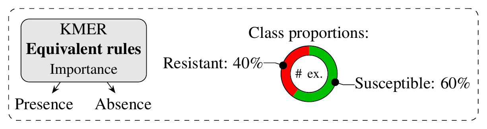

# Antimicrobial resistance prediction models

Rule-based models are available for the following algorithms:
* Set Covering Machines (bound selection)
* Classification and Regression Trees (bound selection)

The models are organized by algorithm, species, and antimicrobial agent.


## Visualization

A visual representation of each model is given in PNG and PDF format (see [example](https://github.com/aldro61/kover2_paper/tree/master/models/cart_b/mycobacterium%20tuberculosis/pyrazinamide/repeat_5/README.md)). The model is shown as a hierarchical arrangement of rules (boxes) and leaves (rings) as displayed in the legend below. Predictions are made by placing a genome at the root and branching left or right based on the outcome of the rules, until a leaf is reached. A leaf predicts the most abundant class among the training examples that were guided into it. The number of such examples is shown in its center and the ring is colored according to the distribution of their phenotypes (classes). Each rule detects the presence/absence of a *k*-mer which is identified in the box. Additionally, each box contains a measure of rule importance and the number of rules that were found to be equivalent during training.

<a href="./legend.pdf"></a>

You can generate this representation for your model using the following script:

```
python plot_model.py model.fasta
```

Or for all models present in a directory structure with:

```
python plot_all.py --dir cart_b/
```

## Format

All models are provided in FASTA format to facilitate their annotation using tools such as [BLAST](https://blast.ncbi.nlm.nih.gov/Blast.cgi?PROGRAM=blastn&PAGE_TYPE=BlastSearch&LINK_LOC=blasthome). Equivalent rules are also given in separate FASTA files.
