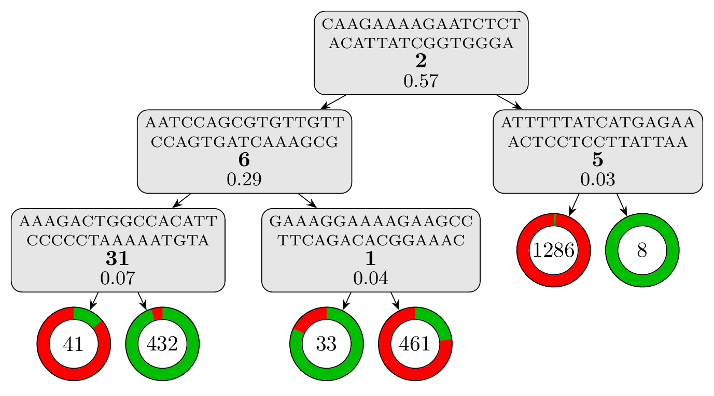

# Model

Species: *Streptococcus pneumoniae*

Antibiotic: Trimethoprim_Sulfamethoxazole

For details, please refer to the [results directory](../../../../../results/cart_b/streptococcus%20pneumoniae/trimethoprim_sulfamethoxazole/repeat_7/).

