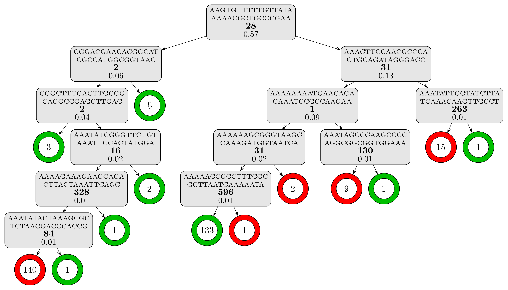
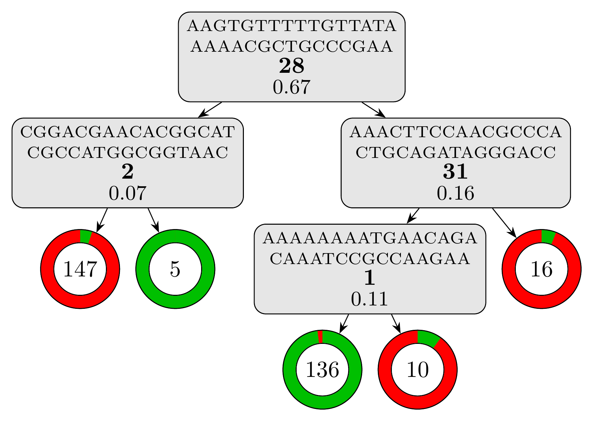

# Tutorial: genotype-to-phenotype models with Kover

This tutorial will walk you through an application of Kover to a set of genomes labelled according to their phenotypes. We use data from the paper (see [data](../data/)), but you could use your own. Specifically, we will learn a model that predicts Azithromycin resistance in *Neisseria gonorrhoeae*.

For an introduction to machine learning , please refer to [this tutorial](https://aldro61.github.io/microbiome-summer-school-2017/sections/basics/).

## Outline

* [Getting the example data](#getting-the-example-data)
* [Creating a Kover dataset](#creating-a-kover-dataset)
* [Splitting the data into training and testing sets](#splitting-the-data-into-training-and-testing-sets)
* [Learning models with:](#learning-models)
  * [Set Covering Machines](#set-covering-machines)
  * [Classification and Regression Trees](#classification-and-regression-trees)
* [Interpreting the learned models](#interpreting-the-learned-models)
  * [Annotating k-mers](#annotating-k-mers)
  * [Analyzing equivalent rules](#analyzing-equivalent-rules)


## Getting the example data

In this first step, we will acquire the data required for the tutorial and package it into a format usable by Kover.

 **Warning:** Creating the dataset from scratch takes about **20 minutes** on a laptop. Alternatively, you can download a [pre-created dataset](https://graal.ift.ulaval.ca/public/kover2_example.zip) (~100 Mb) and skip to [here](#exploring-the-dataset).

First, download the [example data](https://graal.ift.ulaval.ca/public/kover_example_data.zip) (~250 Mb), which contains the genome of 392 *Neisseria gonorrhoeae* isolates, along with their susceptibility to Azithromycin.

## Creating a Kover dataset

Before using Kover to learn a model, we must package the genomic and phenotypic data into a [Kover dataset](doc_dataset.html#creating-a-dataset), which relies on the HDF5 library to store a compressed representation of the data ([details here](https://github.com/aldro61/kover/wiki/Kover-Dataset-Format)).

To create a dataset, use the following command:

```
kover dataset create from-contigs --genomic-data genome_contigs.tsv --phenotype-description "Azithromycin resistance" --phenotype-metadata metadata.tsv --output example.kover --temp-dir contigs/tmp --progress
```

This produces a dataset file called "example.kover". From now on, you no longer need the original data files.

### Exploring the dataset

 **Note:** If you skipped the dataset creation step, download the [example dataset](https://graal.ift.ulaval.ca/public/kover_example.zip) (~100 Mb).

You can use the [kover dataset info](doc_dataset.html#listing-information-about-a-dataset) command to print information about the dataset. For example, t print the number of genomes and k-mers in the dataset, use:

```
kover dataset info --dataset example.kover --genome-count --kmer-count
```

Your dataset contains **392 genomes vs 4 766 702 k-mers**! This is know as the *fat data* setting, which is very different from the *big data* setting in which the number of examples (genomes) is greater than the number of features (k-mers).

## Splitting the data into training and testing sets

In order to measure the accuracy of the model obtained using Kover, we must split the dataset into a training set and a 
validation set. The training set will be used to learn a model and the validation set will be used to estimate its accuracy.
A Kover dataset can contain multiple splits of the data. The command used for splitting a dataset is [kover dataset split](doc_dataset.html#splitting-a-dataset).

Kover implements a machine learning algorithm and thus has [hyperparameters](doc_learning.html#understanding-the-hyperparameters),
which are free parameters that must be tuned to the data at hand. The most widely used method for setting hyperparameter values
is [k-fold cross-validation](doc_learning.html#k-fold-cross-validation).
In this example, we will use 10-fold cross-validation.

The following command creates a split of the data called "example_split", which uses 80% of the genomes for training and
20% for testing. It also creates 10 cross-validation folds. The data are partitioned randomly, using 2 as the random seed.

```
kover dataset split --dataset example.kover --id example_split --train-size 0.80 --folds 10 --random-seed 2 --progress
```

## Learning models

Now that we have created and split the dataset, we are ready to learn a predictive model of Azithromcycin resistance in *Mycobacterium tuberculosis*. The [kover learn](doc_learning.html#learning-models) command is used to learn models, both Set Covering Machines and Classficication and Regression Trees.

### Set Covering Machines

Let's first learn a Set Covering Machine model containing at most 10 rules, to try both
conjunction (logical-AND) and disjunction (logical-OR) models and the values 0.1, 1.0 and 10.0 for the *p*
hyperparameter (see [hyperparameters](doc_learning.html#understanding-the-hyperparameters)).

#### Cross-Validation

The following command tells Kover to learn a scm model while using cross-validation as the [hyperparameter selection strategy](doc_learning.html#hyperparameter-selection-strategies).
Moreover, it distributes the cross-validation on 4 CPUs and outputs the results files into the *results/scm_cv* directory.

```
kover learn scm --dataset example.kover --split example_split --model-type conjunction disjunction --p 0.1 1.0 10.0 --max-rules 10 --hp-choice cv --n-cpu 4 --output-dir results/scm_cv --progress
```

The total computation time is around **3 minutes**. Kover then uses the obtained model to predict the phenotype of the genomes in the testing set and computes various metrics.
For this example, the obtained model is:

```
Model (Conjunction - 3 rules):
------------------------------
Presence(AAACTTCCAACGCCCACTGCAGATAGGGACC) [Importance: 0.74, 62 equivalent rules]
AND
Absence(AGAGTCGTTGTCTTTGGGCCATTCGCCGTGA) [Importance: 0.17, 2 equivalent rules]
AND
Presence(ATTCGACTGTGCGTAAAAATCGTCCGCTACG) [Importance: 0.18, 7 equivalent rules]
```

Notice the simplicity and interpretability of the obtained model. 
The testing set metrics for this model are:

```
Error Rate: 0.08974
Sensitivity: 1.0
Specificity: 0.85106
Precision: 0.81579
Recall: 1.0
F1 Score: 0.89855
True Positives: 31.0
True Negatives: 40.0
False Positives: 7.0
False Negatives: 0.0
```

#### Bound selection

Let's now use the risk bound derived from Sample Compression Theory as as the [hyperparameter selection strategy](doc_learning.html#hyperparameter-selection-strategies) and compare it to cross-validation. We only have to modify the previous command to specify *bound* as the *hp-choice* and output the results files in another directory, *results/scm_b*.

```
kover learn scm --dataset example.kover --split example_split --model-type conjunction disjunction --p 0.1 1.0 10.0 --max-rules 10 --hp-choice bound  --output-dir results/scm_b --progress
```
Using the bound selection, the computation time drop to just under **20 seconds**! The resulting model has the same number of rules but different ones.

```
Model (Conjunction - 3 rules):
------------------------------
Absence(AAGTGTTTTTGTTATAAAAACGCTGCCCGAA) [Importance: 0.85, 28 equivalent rules]
AND
Presence(AAACTTCCAACGCCCACTGCAGATAGGGACC) [Importance: 0.60, 62 equivalent rules]
AND
Absence(ACACGGGGATGAGTTTGAACAGGTCGGTTAC) [Importance: 0.19, 19 equivalent rules]
```

And the testing set metrics for this new model are:
```
Error Rate: 0.02564
Sensitivity: 1.0
Specificity: 0.95745
Precision: 0.93939
Recall: 1.0
F1 Score: 0.96875
True Positives: 31.0
True Negatives: 45.0
False Positives: 2.0
False Negatives: 0.0
```

As we can see for this example, using the risk bound instead of cross-validation takes less time to compute and gives us a model with better accuracy.

### Classification and Regression Trees
** Dont forget to mention multiclass can be done and how **

Let's now learn a Decision Tree model using the Classification and Regression Tree algorithm.

#### Cross-Validation

The following command tells Kover to learn a tree model while using cross-validation as the [hyperparameter selection strategy](doc_learning.html#hyperparameter-selection-strategies).
Moreover, it distributes the cross-validation on 4 CPUs and outputs the results files into the *results/cart_cv* directory.

```
kover learn tree --dataset example.kover --split example_split --criterion gini --max-depth 20 --min-samples-split 2 --hp-choice cv --n-cpu 4 --output-dir results/cart_cv --progress
```

The computation time is little under **5 minutes** and the resulting tree model with 12 rules and a depth of 6 is textually represented in the report (*results/cart_cv/report.txt*). For a better visual representation, we can use the *plot_model.py* script already in the tutorial directory:

```
python plot_model.py results/cart_cv/model.fasta
```
to obtain the following representation showing the complexity of this decision tree model:

<a></a>

The testing set metrics for this model are:

```
Error Rate: 0.03846
Sensitivity: 1.0
Specificity: 0.93617
Precision: 0.91176
Recall: 1.0
F1 Score: 0.95385
True Positives: 31.0
True Negatives: 44.0
False Positives: 3.0
False Negatives: 0.0
```
#### Bound selection
Again, let's now use the risk bound derived from Sample Compression Theory as as the [hyperparameter selection strategy](doc_learning.html#hyperparameter-selection-strategies) and see how it affect the learning for CART. We only have to modify the previous command to specify *bound* as the *hp-choice* and output the results files in another directory, *results/cart_b*.

```
kover learn tree --dataset example.kover --split example_split --criterion gini --max-depth 20 --min-samples-split 2 --hp-choice bound --n-cpu 4 --output-dir results/cart_b --progress
```
Using the bound selection, the computation time drop to just under **25 seconds**! The resulting model is a lot simpler with only 4 rules and a depth of 3. Using the same script to plot the model:

```
python plot_model.py results/cart_b/model.fasta
```
we obtain this visual representation highlighting how simple and interpretable this model is:

<a></a>

And the testing set metrics for this new model are:

```
Error Rate: 0.01282
Sensitivity: 1.0
Specificity: 0.97872
Precision: 0.96875
Recall: 1.0
F1 Score: 0.98413
True Positives: 31.0
True Negatives: 46.0
False Positives: 1.0
False Negatives: 0.0
```

## Interpreting the learned models

### Annotating k-mers
Show a simple example using nucleotide BLAST

### Analyzing equivalent rules
Show a simple example using UGENE
