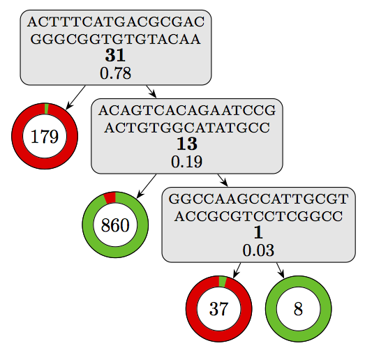

# Interpreting Kover models

- [Interpreting Kover models](#interpreting-kover-models)
                - [Accessing the model](#accessing-the-model)
                - [Visualizing the model](#visualizing-the-model)
                - [Annotating k-mers](#annotating-k-mers)
                - [Analyzing equivalent rules](#analyzing-equivalent-rules)


One particularity of models learned with Kover is that they are highly interpretable. The models make predictions based on rules that capture the presence/absence of k-mers. Below, we show how simple it is to go from a learned model to biological interpretation with these models.

 **Disclaimer:** It is always possible to visualize Kover models and access the sequences of k-mers that are used for prediction. However, going further and annotating the sequences is highly dependent on the quality of available genome annotations. Below, we provide an example where well-annotated genomes were available, enabling a detailed interpretation of the model.

In this tutorial, we will show how the decision tree model of kanamycin resistance in *M. tuberculosis* (Figure 3a of the paper) was processed in order to extract a biological interpretation.

### Accessing the model

After each run of `kover learn`, a `model.fasta` file is created in the output directory. This file contains the sequence of each k-mer used by the model, along with an informative header that specifies how the rule participates in the model.

In this tutorial, we will use the following model (see [here](../../models/cart_b/mycobacterium%20tuberculosis/kanamycin/repeat_1/model.fasta)):
```
>rule_id: 0___ex_1084___eq_31, left_child: leaf___ex_179___sensitive_6_0.01704545__resistant_173_0.98295455, right_child: 2___ex_905___eq_13, importance: 0.78
ACTTTCATGACGCGACGGGCGGTGTGTACAA

>rule_id: 2___ex_905___eq_13, left_child: leaf___ex_860___sensitive_833_0.93912063__resistant_27_0.06087937, right_child: 4___ex_45___eq_1, importance: 0.19
ACAGTCACAGAATCCGACTGTGGCATATGCC

>rule_id: 4___ex_45___eq_1, left_child: leaf___ex_37___sensitive_3_0.04225352__resistant_34_0.95774648, right_child: leaf___ex_8___sensitive_8_1.00000000__resistant_0_0.00000000, importance: 0.03
GGCCAAGCCATTGCGTACCGCGTCCTCGGCC
```

Interestingly, this file completely specifies the structure of the model and expert users could use it to integrate the model in external software. However, this goes beyond the scope of this tutorial.

Below, we will see how we can refine this FASTA file to get deeper insight into the model.


### Visualizing the model

Let's start by visualizing the model. For models learned with the Set Covering Machine algorithm, simply open the `report.txt` file in the output directory to visualize the model's logic. There is no need for fancy visualizations in this case, since the structure of the model is very simple (logical-AND or logical-OR).
However, decision tree models can be more complex and thus, it is interesting to plot the model.

You can plot any decision tree model using the `plot_model.py` script (see [here](../../models/plot_model.py)) as follows:
```
python plot_model.py model.fasta
```
 **Warning:** The script assumes that [LaTeX](https://www.latex-project.org/get/) is installed on your computer.

Using this script on our model yields the following visualization:
<a href="./model.pdf"></a>


### Annotating k-mers

After learning a model, the results directory contains a file called `model.fasta`, which contains each k-mer in the model, along with an informative header. Conveniently, these FASTA files can be directly inputted into tools such as [Nucleotide BLAST](https://blast.ncbi.nlm.nih.gov/Blast.cgi?PAGE_TYPE=BlastSearch).

In this example, we will use the model 

### Analyzing equivalent rules
Show a simple example using UGENE